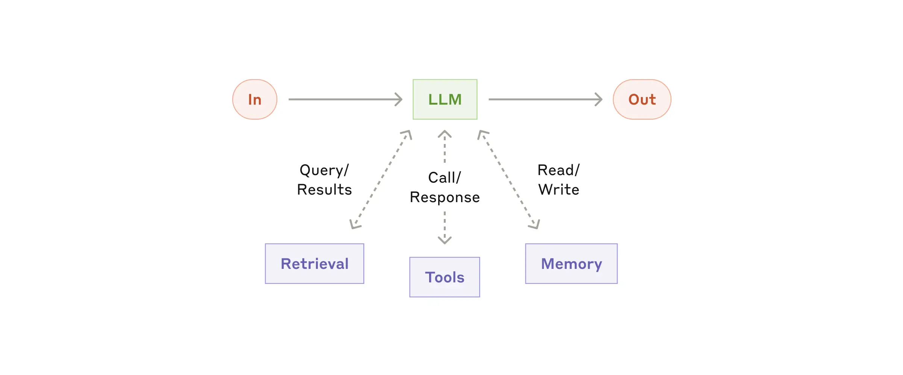
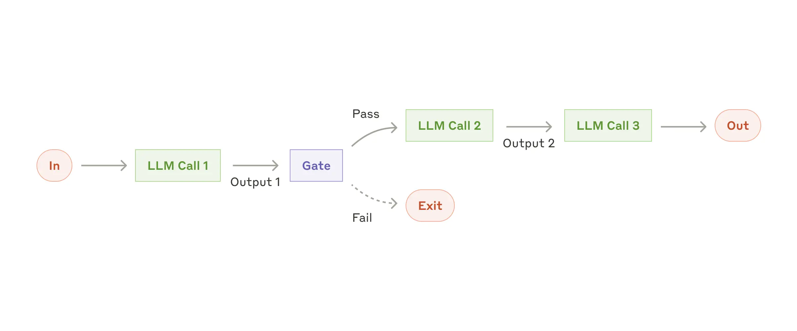
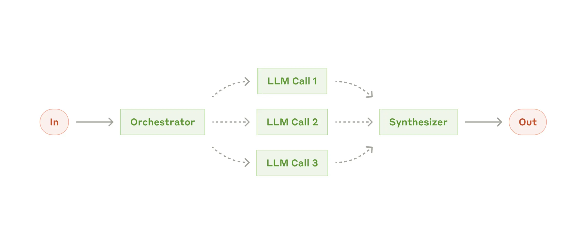
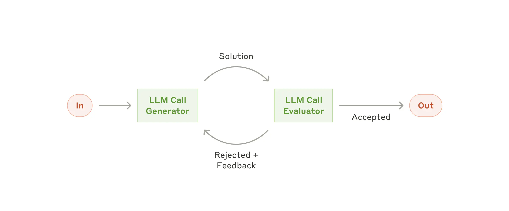
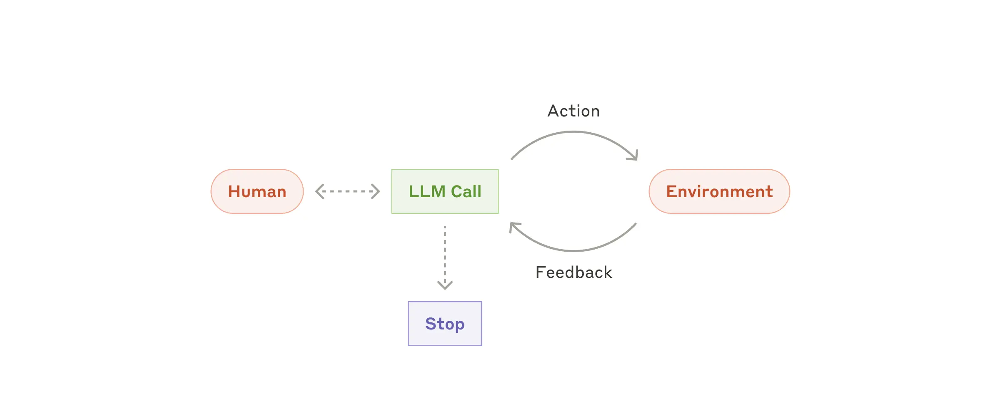
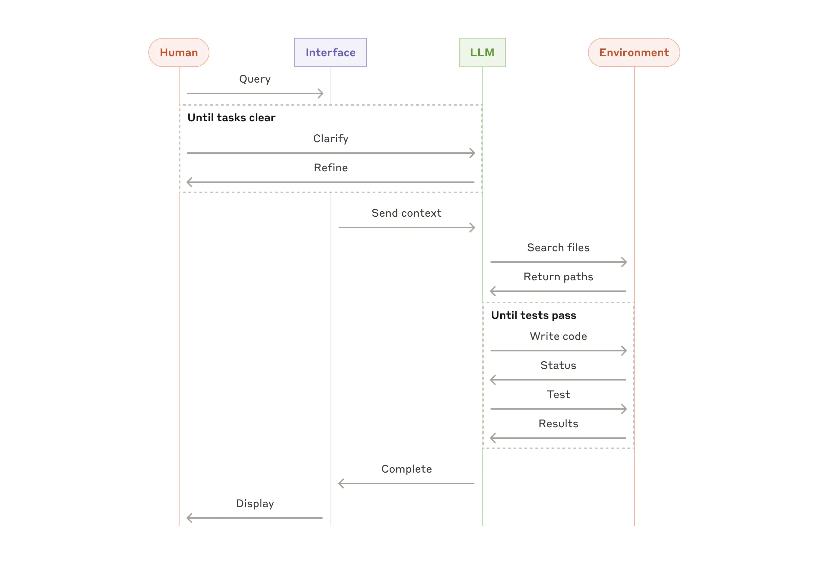

# LLM Agent Systems Summary

**Date:** December 20, 2024

For more information, see offical Docs [Anthropic Building Effective Agents](https://www.anthropic.com/research/building-effective-agents).

This summary explains the basic building blocks and workflows for effective LLM agent systems in simple, desi-style English.

---

## 1. Building Block: The Augmented LLM

**What it is:**  
A basic language model (LLM) enhanced with extra features like memory, retrieval, and tool usage. This helps the LLM to generate its own search queries, pick the right tool, and remember important information.

**Diagram:**

---

## 2. Workflow: Prompt Chaining

**What it is:**  
Breaking a big task into a sequence of smaller steps. Each step’s output is used as input for the next step, making the whole process easier to manage.

**Diagram:**

---

## 3. Workflow: Routing

**What it is:**  
Classifying the input to decide which specific process should handle it. This is useful when different types of tasks need different handling.

**Diagram:**

---

## 4. Workflow: Parallelization

**What it is:**  
Splitting a task into smaller parts that run at the same time. There are two main methods:
- **Sectioning:** Dividing a task into independent parts.
- **Voting:** Running the same task multiple times and comparing outputs.

**Diagram:**

---

## 5. Workflow: Orchestrator-workers

**What it is:**  
A central “orchestrator” breaks the main task into smaller subtasks and assigns them to worker LLMs. After they complete their parts, the orchestrator gathers all outputs to form the final result.

**Diagram:**

---

## 6. Workflow: Evaluator-optimizer

**What it is:**  
A two-step process where one LLM generates an output and another evaluates that output. Feedback is given, and the process repeats until the quality is good enough.

**Diagram:**

---

## Final Thoughts

- **Keep It Simple:**  
  Start with simple implementations (like single LLM calls with retrieval and examples). Increase complexity only when it shows clear benefits.

- **Mix & Match:**  
  These building blocks and workflows can be combined in different ways based on your specific needs. The goal is to build agents that are powerful, reliable, and easy to understand.

- **Test & Iterate:**  
  Always test your systems and improve them with feedback. Transparency and clear documentation of each step are key to success.

This summary captures the core ideas and diagrams to help you build and understand effective LLM agent systems in a straightforward, desi-style manner.

**Agents Diagram:**

**Agent all work flow**
